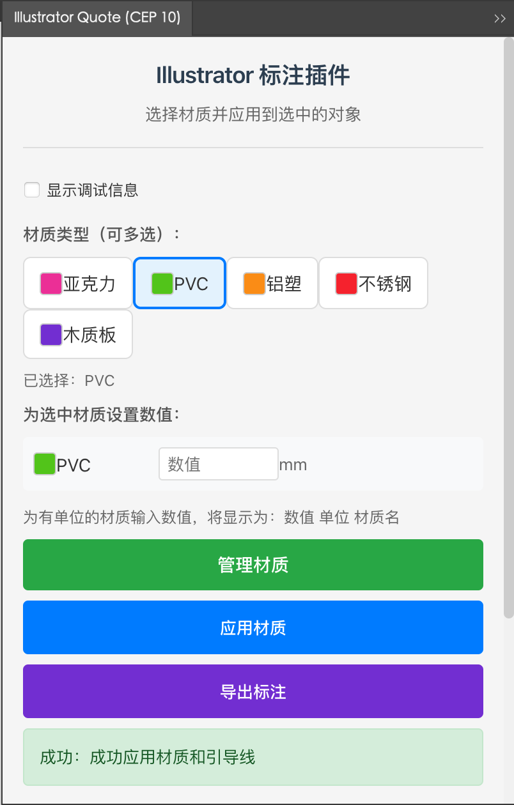
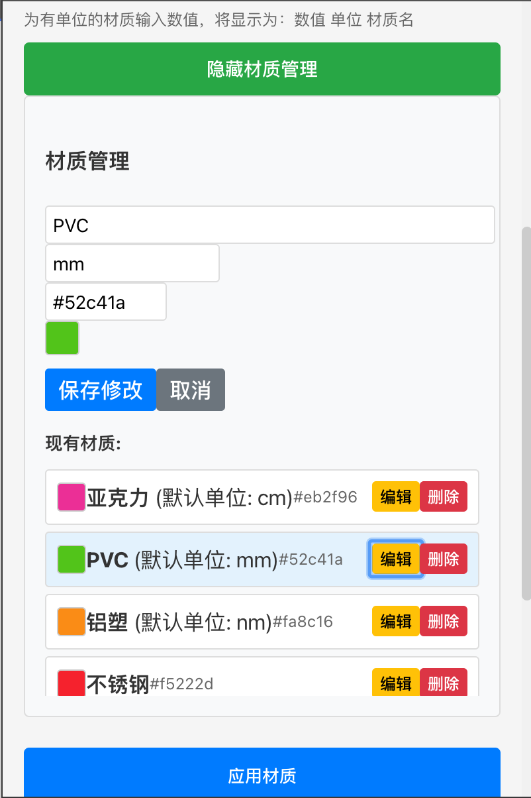
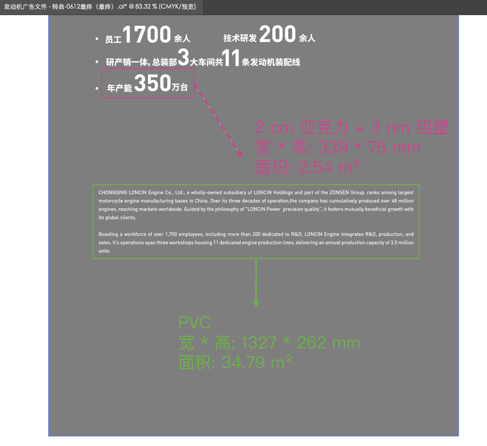

# Illustrator Annotation Plugin (CEP 12)

<div align="center">

**A professional Adobe Illustrator material annotation plugin with CEP 12 support for Illustrator 2025+**

[](https://opensource.org/licenses/MIT)
[](https://github.com/Adobe-CEP/CEP-Resources)
[](https://www.adobe.com/products/illustrator.html)
[](https://nodejs.org/)

[Features](#-features) • [Plugin Preview](#-plugin-preview) • [Installation](#-installation-guide) • [Usage](#-usage-guide) • [Development](#-development-guide) • [Troubleshooting](#-troubleshooting)

**[中文文档 (Chinese Documentation)](README-CN.md)**

</div>

## 🎯 Features

### 🎨 Material Management System
- **📦 Manageable Material Library** - Add, edit, delete custom materials with unit management
- **💾 Local Storage** - Persistent material data storage
- **🏷️ Multi-selection Support** - Select multiple materials simultaneously for annotation
- **📋 Preset Materials** - Built-in common material data

### 🔧 Annotation Features
- **📏 Auto-calculation** - Automatically calculate dimensions and area based on object bounding box
- **🏷️ Smart Annotation** - Automatically add material information and leader lines next to objects
- **📊 Data Export** - One-click export to CSV format including width and height information
- **🎯 Multi-object Support** - Batch processing of multiple selected objects
- **📐 Unit Management** - Set default units for each material with personalized value input

### 🚀 Technical Features
- **CEP 12** - Support for the latest Adobe Illustrator 2025+
- **Chromium 99** - Modern web standards support
- **React + TypeScript** - Modern frontend technology stack
- **ExtendScript** - Deep integration with Illustrator API

## 📦 Preset Materials

| Material Type | Color ID | Description |
|---------------|----------|-------------|
| Acrylic | 🔴 | High transparency, suitable for display |
| PVC | 🟢 | Low cost, suitable for large area use |
| Fleece | 🟠 | Good texture, suitable for premium applications |
| Stainless Steel | 🔴 | Premium texture, corrosion resistant |
| Wood-plastic | 🟣 | Natural texture, eco-friendly material |

> 💡 **Tip**: All materials can be customized through the material management function, and default units can be set

## 📸 Plugin Preview

### Main Interface


*Main interface showing material selection, unit settings and application functions*

### Material Management


*Material management interface supports adding, editing and deleting materials, setting default units and colors*

### Actual Application Effect


*Actual application effect in Illustrator, showing multi-material annotation and dimension information*

## 🛠️ System Requirements

### Required Versions
- **Adobe Illustrator 2025** (Version 29.0) or higher
- **CEP 12** support
- **Node.js 17.7.1** or higher (for development environment)

### Operating Systems
- **Windows 10/11** or higher
- **macOS 10.15** or higher

## 🚀 Installation Guide

### Version Selection Guide

Please choose the corresponding plugin version based on your Illustrator version:

| Illustrator Version | CEP Version | Plugin Version | Branch | Recommendation |
|--------------------|-------------|----------------|--------|--------------|
| **2025+** | **CEP 12** | **v2.x.x** | **main** | ✅ **Latest Version** |
| 2021-2024 | CEP 10 | v1.5.x | cep10-support | 🟡 **Stable Compatible** |

### Method 1: ZXP File Installation (Recommended)

#### Step 1: Install Tool
Download one of the following installation tools:

- **[Anastasiy's Extension Manager](https://install.anastasiy.com/)** (Recommended)
- **[ZXPInstaller](https://aescripts.com/learn/zxp-installer/)**

#### Step 2: Install Plugin
1. Download the latest `illustrator-annotation-plugin-v2.0.0.zxp` file
2. Open the installation tool
3. Drag the `.zxp` file to the tool window
4. Click install

> 📄 For detailed installation instructions, please see [INSTALLATION.md](INSTALLATION.md)

### Method 2: Development Environment Installation

```bash
# Clone project
git clone https://github.com/yourusername/illustrator-annotation-plugin.git
cd illustrator-annotation-plugin

# Install dependencies
npm install

# Build and install to development environment
npm run install-debug
```

### Manual Installation

1. **Build Plugin**
   ```bash
   # Install dependencies
   yarn install
   
   # Build plugin
   yarn build:cep
   ```

2. **Enable Debug Mode**
   
   **Windows (Registry):**
   ```
   HKEY_CURRENT_USER\Software\Adobe\CSXS.12
   Create string value: PlayerDebugMode = 1
   ```
   
   **macOS (Terminal):**
   ```bash
   defaults write com.adobe.CSXS.12 PlayerDebugMode 1
   ```

3. **Copy Plugin Files**
   
   Copy the `dist` folder to the CEP extension directory:
   
   **Windows:**
   ```
   C:\Users\[Username]\AppData\Roaming\Adobe\CEP\extensions\illustrator-annotation-plugin
   ```
   
   **macOS:**
   ```
   ~/Library/Application Support/Adobe/CEP/extensions/illustrator-annotation-plugin
   ```

## 📖 Usage Guide

### 1. Launch Plugin

1. Open Adobe Illustrator 2025+
2. Menu bar → **Window** → **Extensions** → **Illustrator Quote**
3. Plugin panel will appear on the right side

### 2. Material Management

<details>
<summary>Click to expand material management tutorial</summary>

#### Add New Material
1. Click the "**Manage Materials**" button
2. Enter material name, default unit, and color
3. Click "**Add Material**" button

#### Edit Material
1. Click the "**Edit**" button for a material in the material list
2. Modify material name, unit, or color
3. Click "**Save Changes**" button

#### Delete Material
1. Click the "**Delete**" button for a material in the material list
2. Confirm the deletion operation

> ⚠️ **Note**: The system keeps at least one material; you cannot delete the last material

</details>

### 3. Apply Material Annotation

<details>
<summary>Click to expand annotation operation tutorial</summary>

#### Basic Operations
1. Select the objects to annotate in Illustrator
2. Select one or more material types in the plugin panel
3. Set values for materials with units (optional)
4. Click "**Apply Material**" button
5. Select annotation position

#### Multi-material Annotation
1. Select multiple materials (click material cards to select/deselect)
2. Set values for each material individually
3. After application, it will display like: "12 cm Acrylic + 5 mm PVC"

#### Export Annotation Data
1. Complete material application for all objects
2. Click "**Export Annotation**" button
3. CSV file will be automatically saved to desktop

**Export content includes:**
- Layer name
- Material information (with values and units)
- Width (mm)
- Height (mm)
- Area (m²)

</details>

### 4. Debug Features

- Check "Show debug information" to view detailed operation process
- Click "**Debug Test**" button to check plugin status
- View debug information to confirm system is working properly

## 🔧 Development Guide

### Technology Stack
- **Frontend**: React 19 + TypeScript + Vite
- **CEP**: CEP 12 + ExtendScript
- **Build**: Yarn + ESLint

### Development Environment Setup

```bash
# Clone project
git clone https://github.com/yourusername/illustrator-annotation-plugin.git
cd illustrator-annotation-plugin

# Install dependencies
yarn install

# Development mode
yarn dev

# Build CEP plugin
yarn build:cep

# Code linting
yarn lint

# Create release package
yarn release
```

### Project Structure

```
illustrator-annotation-plugin/
├── src/                    # React source code
│   ├── App.tsx            # Main application component
│   ├── App.css            # Style files
│   └── main.tsx           # Entry file
├── jsx/                   # ExtendScript files
│   ├── applyMaterial.jsx  # Material application script
│   └── exportQuote.jsx    # Quote export script
├── CSXS/                  # CEP configuration
│   └── manifest.xml       # Plugin manifest
├── lib/                   # CEP library files
│   └── CSInterface.js     # CEP interface
├── scripts/               # Build scripts
│   ├── create-zxp.js      # ZXP packaging script
│   └── install-debug.js   # Development installation script
├── dist/                  # Build output
├── release/               # Release files
└── docs/                  # Documentation
```

### Release Process

1. **Build Plugin**: `yarn build:cep`
2. **Create ZXP**: `yarn create-zxp`
3. **Test Installation**: Test with generated ZXP file
4. **Release**: Upload ZXP file and installation instructions

## 🔍 Troubleshooting

### Common Issues

<details>
<summary>Plugin displays white screen</summary>

**Solutions:**
1. Confirm using Illustrator 2025+ version
2. Check if CEP 12 debug mode is enabled
3. Check browser console for error information
4. Verify plugin file integrity

</details>

<details>
<summary>Plugin not showing in menu</summary>

**Solutions:**
1. Check if plugin is correctly installed to CEP extension directory
2. Confirm manifest.xml version configuration is correct
3. Restart Illustrator application
4. Check CEP debug mode settings

</details>

<details>
<summary>Material application fails</summary>

**Solutions:**
1. Confirm objects are selected
2. Check if objects support bounding box calculation
3. Check error information in debug messages
4. Try using "Debug Test" function

</details>

### Debug Mode Setup

**Windows:**
```cmd
reg add "HKEY_CURRENT_USER\Software\Adobe\CSXS.12" /v PlayerDebugMode /t REG_SZ /d 1 /f
```

**macOS:**
```bash
defaults write com.adobe.CSXS.12 PlayerDebugMode 1
```

## 📄 License

This project is open source under the MIT License - see the [LICENSE](LICENSE) file for details.

## 🤝 Acknowledgments

- [Adobe CEP](https://github.com/Adobe-CEP/CEP-Resources) - CEP development resources
- [React](https://reactjs.org/) - Frontend framework
- [TypeScript](https://www.typescriptlang.org/) - Type safety
- [Vite](https://vitejs.dev/) - Build tool
- [zxp-sign-cmd](https://github.com/codearoni/zxp-sign-cmd) - ZXP signing tool

## 📞 Support & Feedback

- 🐛 [Report Bug](https://github.com/xuanheScript/illustrator-quote-plugin/issues)
- 💡 [Feature Request](https://github.com/xuanheScript/illustrator-quote-plugin/issues)
- 📄 [Detailed Installation Guide](INSTALLATION.md)

---

<div align="center">

**If this project helps you, please give it a ⭐️**

Made with ❤️ by Illustrator Annotation Plugin Team

</div>